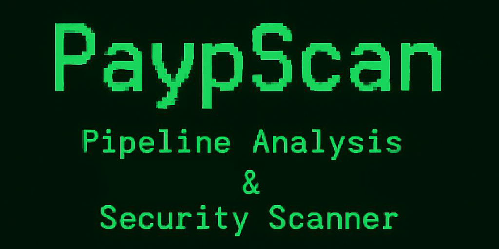

# PaypScan - Pipeline Analysis & Security Scanner



** DevOps Pipeline Security Analysis Tool**

A real-time security scanner that monitors  DevOps pipelines for dangerous patterns, suspicious code execution, and potential security vulnerabilities.

[](https://opensource.org/licenses/MIT)
[](https://www.python.org/downloads/)
[](https://azure.microsoft.com/services/devops/)

## 🚀 Features

- **🔍 Real-time Analysis**: Monitor pipeline builds as they happen
- **🛡️ 40+ Security Patterns**: Detect dangerous code patterns automatically
- **📱 Slack Alerts**: Real-time notifications via Slack
- **📊 Risk Scoring**: Prioritize threats with intelligent scoring
- **🔄 Webhook Integration**: Seamless Azure DevOps integration
- **💾 Database Storage**: Track and analyze security findings
- **🛠️ Modular Architecture**: Easy to extend and customize

## 📋 Table of Contents

- [Quick Start](#-quick-start)
- [Installation](#-installation)
- [Configuration](#-configuration)
- [Usage](#-usage)
- [Security Patterns](#-security-patterns)
- [Webhook Setup](#-webhook-setup)
- [Alert Configuration](#-alert-configuration)
- [Troubleshooting](#-troubleshooting)
- [API Reference](#-api-reference)
- [Contributing](#-contributing)
- [License](#-license)

## ⚡ Quick Start

### 1. Clone the Repository
```bash
git clone https://github.com/yourusername/pipeline-security-analysis.git
cd pipeline-security-analysis
```

### 2. Install Dependencies
```bash
python -m venv venv
source venv/bin/activate  # On Windows: venv\Scripts\activate
pip install -r requirements.txt
```

### 3. Configure Environment
```bash
cp env.example .env
# Edit .env with your Azure DevOps and Slack settings
```

### 4. Start ngrok
```bash
ngrok http 5000
# Copy the HTTPS URL (e.g., https://abc123.ngrok-free.app)
```

### 5. Configure Azure DevOps Webhook
1. Go to Azure DevOps → Project Settings → Service Hooks
2. Click "Create subscription"
3. Select "Build completed" event
4. Set webhook URL: `https://your-ngrok-url.ngrok-free.app/webhook`
5. Test the connection

### 6. Start Webhook Server
```bash
cd webhook_scripts
python webhook_server.py
```

### 7. Start Webhook Listener
```bash
# In another terminal
cd webhook_scripts
python simple_webhook_listener.py
```

### Alternative: Manual Analysis
If you don't want to set up webhooks, you can run manual analysis:
```bash
python main.py --analyze-yaml --analyze-build --analyze-logs
```

## 🛠️ Installation

### Prerequisites

- **Python 3.8+**
- **Azure DevOps Account** with Personal Access Token
- **ngrok** (for webhook testing)
- **Slack** (for notifications)

### Step-by-Step Installation

#### 1. System Requirements
```bash
# Ubuntu/Debian
sudo apt update
sudo apt install python3 python3-pip python3-venv

# macOS
brew install python3

# Windows
# Download from https://www.python.org/downloads/
```

#### 2. Clone and Setup
```bash
git clone https://github.com/yourusername/pipeline-security-analysis.git
cd pipeline-security-analysis

# Create virtual environment
python -m venv venv
source venv/bin/activate  # On Windows: venv\Scripts\activate

# Install dependencies
pip install -r requirements.txt
```

#### 3. Database Setup
```bash
# SQLite database will be created automatically
# Location: data/database/pipeline_security.db
```

## ⚙️ Configuration

### Environment Variables

Copy `env.example` to `.env` and configure the following:

#### Azure DevOps Configuration
```bash
# Required: Your Azure DevOps organization
AZURE_ORGANIZATION=your-organization

# Required: Your Azure DevOps project
AZURE_PROJECT=your-project

# Required: Pipeline definition ID to monitor
AZURE_DEFINITION_ID=123

# Required: Personal Access Token (PAT)
AZURE_PAT=your-personal-access-token

# Optional: Custom Azure DevOps server URL
AZURE_DEVOPS_SERVER_URL=https://dev.azure.com
```

#### Webhook Configuration
```bash
# Required: ngrok URL for webhook server (update after starting ngrok)
WEBHOOK_SERVER_URL=https://your-ngrok-url.ngrok-free.app

# Optional: Polling interval (seconds)
WEBHOOK_POLLING_INTERVAL=5

# Optional: Webhook timeout (seconds)
WEBHOOK_TIMEOUT=30
```

#### Slack Configuration
```bash
# Required: Slack webhook URL
SLACK_WEBHOOK_URL=https://hooks.slack.com/services/YOUR/SLACK/WEBHOOK
```

### Getting Azure DevOps Personal Access Token

1. Go to Azure DevOps → User Settings → Personal Access Tokens
2. Click "New Token"
3. Set scope to "Custom defined"
4. Select permissions:
   - Build (Read)
   - Code (Read)
   - Project and Team (Read)
5. Copy the generated token to `AZURE_PAT`

### Getting Slack Webhook URL

1. Go to your Slack workspace → Apps → Incoming Webhooks
2. Click "Add Configuration"
3. Choose channel and click "Add Incoming WebHooks Integration"
4. Copy the Webhook URL to `SLACK_WEBHOOK_URL`

## 🚀 Usage

### Manual Analysis (Without Webhooks)

For manual analysis without webhook setup, you can use the main.py script:

#### Basic Analysis
```bash
# Analyze all aspects
python main.py

# Analyze specific components
python main.py --analyze-yaml
python main.py --analyze-build
python main.py --analyze-logs

# Specify pipeline definition
python main.py --definition-id 123

# Verbose logging
python main.py --verbose
```

### Webhook Listener (Real-time Monitoring)

#### 1. Start ngrok
```bash
ngrok http 5000
# Copy the HTTPS URL (e.g., https://abc123.ngrok-free.app)
```

#### 2. Configure Azure DevOps Webhook
1. Go to Azure DevOps → Project Settings → Service Hooks
2. Click "Create subscription"
3. Select "Build completed" event
4. Set webhook URL: `https://your-ngrok-url.ngrok-free.app/webhook`
5. Test the connection

#### 3. Start Webhook Server
```bash
cd webhook_scripts
python webhook_server.py
```

#### 4. Start Webhook Listener
```bash
# In another terminal
cd webhook_scripts
python simple_webhook_listener.py
```

### Testing

#### Test Slack Notifications
```bash
cd webhook_scripts
python debug_slack.py
```

#### Test Configuration
```bash
cd webhook_scripts
python test_config.py
```

#### Test Logging
```bash
python scripts/test_logging.py
```

### Web Interface

#### Health Check
```bash
curl https://your-ngrok-url.ngrok-free.app/health
```

#### View Events
```bash
curl https://your-ngrok-url.ngrok-free.app/events
```

## 🛡️ Security Patterns

The tool detects 40+ dangerous patterns across multiple languages:

### PowerShell Patterns
- `Invoke-Expression` commands
- `iex` abbreviations
- `powershell -Command` usage
- `powershell -EncodedCommand` usage

### Bash/Shell Patterns
- `eval` commands
- `exec` commands
- `curl | bash` combinations
- `wget | bash` combinations

### Python Patterns
- `eval()` functions
- `exec()` functions
- `subprocess.call()` usage
- `os.system()` usage
- Base64 decode + execute combinations

### JavaScript Patterns
- `eval()` functions
- `Function()` constructor
- `setTimeout()` with dynamic code
- `setInterval()` with dynamic code

### Risk Scoring
- **CRITICAL (10)**: `eval()`, `exec()`
- **HIGH (9)**: Base64 execute combinations
- **MEDIUM (7)**: PowerShell dangerous commands
- **LOW (5)**: Suspicious patterns

## 🔗 Webhook Setup

### 1. Start ngrok
```bash
ngrok http 5000
# Copy the HTTPS URL (e.g., https://abc123.ngrok-free.app)
```

### 2. Configure Azure DevOps Webhook
1. Go to Project Settings → Service Hooks
2. Click "Create subscription"
3. Select "Build completed" event
4. Set webhook URL: `https://your-ngrok-url.ngrok-free.app/webhook`
5. Test the connection

### 3. Start Webhook Server
```bash
cd webhook_scripts
python webhook_server.py
```

### 4. Start Webhook Listener
```bash
# In another terminal
cd webhook_scripts
python simple_webhook_listener.py
```

## 📱 Alert Configuration

### Slack Alerts
```json
{
  "text": "🚨 SECURITY ALERT - Build: 20250807.12",
  "attachments": [{
    "color": "danger",
    "fields": [{
      "title": "Detected Patterns",
      "value": "• EVAL: 3 instances\n• EXEC: 2 instances"
    }]
  }]
}
```

## 🔧 Troubleshooting

### Common Issues

#### 1. "No module named 'dotenv'"
```bash
pip install python-dotenv
```

#### 2. "Azure DevOps authentication failed"
- Check `AZURE_PAT` is correct
- Verify token has required permissions
- Ensure organization/project names are correct

#### 3. "Webhook not receiving events"
- Verify ngrok URL is correct
- Check Azure DevOps webhook configuration
- Ensure webhook listener is running

#### 4. "Slack notifications not working"
- Verify webhook URL is correct
- Check channel permissions
- Test with debug script

#### 5. "Database connection failed"
```bash
# Check database file permissions
chmod 755 data/database/
```

### Debug Commands
```bash
# Test Azure DevOps connection
python -c "from src.utils.azure_client import AzureDevOpsClient; client = AzureDevOpsClient(); print(client.get_pipeline_definition(10))"

# Test Slack connection
python webhook_scripts/debug_slack.py

# Check configuration
python webhook_scripts/test_config.py

# View logs
tail -f logs/audit.log
tail -f logs/security_alerts.log
```

### Log Files
- `logs/audit.log` - General audit events
- `logs/security_alerts.log` - Security findings
- `logs/webhook_events.log` - Webhook events
- `logs/errors.log` - Error messages

## 📚 API Reference

### Webhook Functions

#### `webhook_handler()`
Handles incoming Azure DevOps webhooks.

#### `send_security_alert(build_info, findings)`
Sends security alerts to Slack.

### Configuration Functions

#### `get_azure_config()`
Returns Azure DevOps configuration.

#### `get_notifications_config()`
Returns notification settings.

#### `get_security_patterns()`
Returns security pattern definitions.

## 🤝 Contributing

We welcome contributions! Please feel free to:

- 🐛 Report bugs
- 💡 Suggest new features
- 🔧 Submit pull requests
- 📖 Improve documentation
- 🧪 Add test cases

See the [Contributing](#-contributing) section above for development setup.

### Adding New Security Patterns
1. Edit `config/patterns/blacklist.json`
2. Add pattern to `DANGEROUS_PATTERNS`
3. Set risk score in `RISK_SCORES`
4. Test with sample data

## 📄 License

This project is licensed under the MIT License - see the [LICENSE](LICENSE) file for details.

## 🙏 Acknowledgments

- Azure DevOps API for pipeline integration
- Security community for pattern definitions
- Open source contributors

## 📞 Support

### Getting Help

If you encounter any issues or have questions:

- **🐛 Bug Reports**: [GitHub Issues](https://github.com/nullx3d/PaypScan/issues)
- **💡 Feature Requests**: [GitHub Issues](https://github.com/nullx3d/PaypScan/issues)
- **❓ Questions**: [GitHub Discussions](https://github.com/nullx3d/PaypScan/discussions)
- **📖 Documentation**: Check this README and inline code comments

### Before Submitting an Issue

1. **Check existing issues** - Your problem might already be reported
2. **Search discussions** - Someone might have already asked
3. **Test with latest version** - Make sure you're using the current code
4. **Include details** - OS, Python version, error messages, logs

### Issue Template

When creating an issue, please include:

```markdown
**Environment**
- OS: [e.g., Ubuntu 20.04, macOS 12.0, Windows 11]
- Python Version: [e.g., 3.9.7]
- PaypScan Version: [e.g., latest from main branch]

**Description**
Brief description of the issue

**Steps to Reproduce**
1. Step 1
2. Step 2
3. Step 3

**Expected Behavior**
What should happen

**Actual Behavior**
What actually happens

**Logs**
```
Paste relevant log output here
```

**Additional Context**
Any other information that might be helpful
```

### Contributing

We welcome contributions! Please feel free to:

- 🐛 Report bugs
- 💡 Suggest new features
- 🔧 Submit pull requests
- 📖 Improve documentation
- 🧪 Add test cases

See the [Contributing](#-contributing) section above for development setup. 