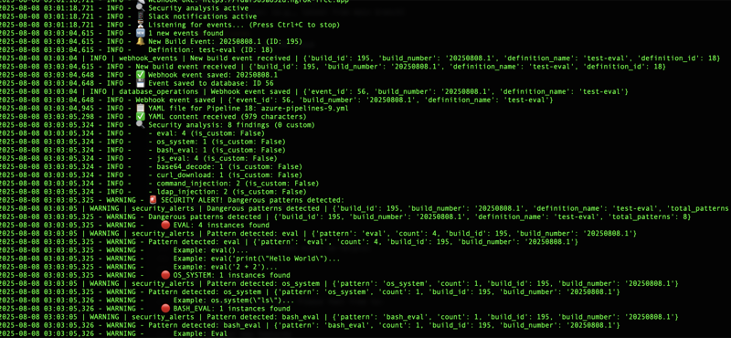
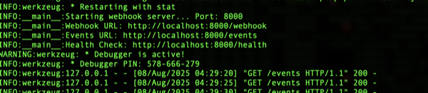
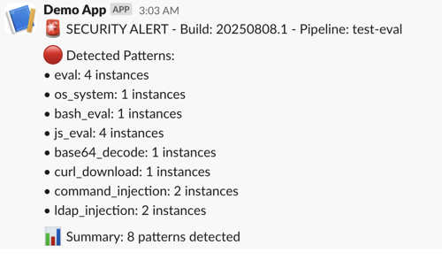
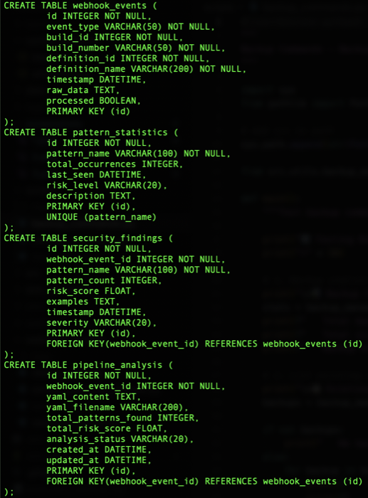

# PaypScan - Pipeline Analysis & Security Scanner


** DevOps Pipeline Security Analysis Tool**

A real-time security scanner that monitors  DevOps pipelines for dangerous patterns, suspicious code execution, and potential security vulnerabilities.

[](https://opensource.org/licenses/MIT)
[](https://www.python.org/downloads/)
[](https://azure.microsoft.com/services/devops/)

## 🚀 Features

- **🔍 Real-time Analysis**: Monitor pipeline builds as they happen
- **🛡️ 250+ Security Patterns**: Detect dangerous code patterns automatically
- **📱 Slack Alerts**: Real-time notifications via Slack
- **📊 Risk Scoring**: Prioritize threats with intelligent scoring
- **🔄 WebSocket Integration**: Real-time connection with no timeout issues
- **💾 Database Storage**: Track and analyze security findings
- **🛠️ Modular Architecture**: Easy to extend and customize
- **⚡ Connection Stability**: WebSocket-based real-time communication

## 🏗️ Current Architecture

<details>
<summary>📊 Click to view Current Architecture Diagram</summary>

```
┌─────────────────────────────────────────────────────────────────────────────────────────────────────────────────────────────────────────────────────────────────┐
│                                                          PAYPSCAN - CURRENT ARCHITECTURE                                                                          │
│                                                         Real-Time DevOps Security Scanner                                                                   │
└─────────────────────────────────────────────────────────────────────────────────────────────────────────────────────────────────────────────────────────────────┘

┌─────────────────────────────────────────────────────────────────────────────────────────────────────────────────────────────────────────────────────────────────┐
│                                                              CURRENT ENTRY POINTS                                                                                 │
├─────────────────────────────────────────────────────────────────────────────────────────────────────────────────────────────────────────────────────────────────┤
│  ┌─────────────────┐    ┌─────────────────┐    ┌─────────────────┐    ┌─────────────────┐    ┌─────────────────┐    ┌─────────────────┐                │
│  │  Azure DevOps   │    │   Manual Test   │    │  Webhook Server │    │  Test Pipelines │    │  YAML Analyzer  │    │  Log Analyzer   │                │
│  │   Pipeline      │    │   (main.py)     │    │   (Flask)       │    │   (Test Files)  │    │   (Security)    │    │   (Build Logs)  │                │
│  │   (Trigger)     │    │                 │    │   Port: 5000    │    │                 │    │                 │    │                 │                │
│  └─────────────────┘    └─────────────────┘    └─────────────────┘    └─────────────────┘    └─────────────────┘    └─────────────────┘                │
│           │                       │                       │                       │                       │                       │                           │
│           ▼                       ▼                       ▼                       ▼                       ▼                       ▼                           │
│  ┌─────────────────┐    ┌─────────────────┐    ┌─────────────────┐    ┌─────────────────┐    ┌─────────────────┐    ┌─────────────────┐                │
│  │   Build Event   │    │  YAML Analysis  │    │  Event Handler  │    │  Pattern Test   │    │  Content Parse  │    │  Log Parse      │                │
│  │   (Webhook)     │    │  (Security)     │    │  (Validation)   │    │  (Validation)   │    │  (Regex Match)  │    │  (Script Block) │                │
│  └─────────────────┘    └─────────────────┘    └─────────────────┘    └─────────────────┘    └─────────────────┘    └─────────────────┘                │
└─────────────────────────────────────────────────────────────────────────────────────────────────────────────────────────────────────────────────────────────────┘

┌─────────────────────────────────────────────────────────────────────────────────────────────────────────────────────────────────────────────────────────────────┐
│                                                          CURRENT WEBHOOK PROCESSING                                                                                │
├─────────────────────────────────────────────────────────────────────────────────────────────────────────────────────────────────────────────────────────────────┤
│  ┌─────────────────┐    ┌─────────────────┐    ┌─────────────────┐    ┌─────────────────┐    ┌─────────────────┐    ┌─────────────────┐                │
│  │  Webhook Server │    │  Event Parser   │    │  Duplicate Check│    │  Event Queue    │    │  Event Logger   │    │  ngrok Tunnel   │                │
│  │   (Flask)       │───▶│  (JSON Parse)   │───▶│  (Build ID)     │───▶│  (Processing)   │───▶│  (Audit Trail)  │───▶│  (HTTPS)        │                │
│  │   Port: 5000    │    │                 │    │                 │    │                 │    │                 │    │                 │                │
│  └─────────────────┘    └─────────────────┘    └─────────────────┘    └─────────────────┘    └─────────────────┘    └─────────────────┘                │
│           │                       │                       │                       │                       │                       │                           │
│           ▼                       ▼                       ▼                       ▼                       ▼                       ▼                           │
│  ┌─────────────────┐    ┌─────────────────┐    ┌─────────────────┐    ┌─────────────────┐    ┌─────────────────┐    ┌─────────────────┐                │
│  │  Request Valid. │    │  Content Type   │    │  Rate Limiting  │    │  Error Handler  │    │  Health Check   │    │  SSL/TLS        │                │
│  │  (Headers)      │    │  (JSON/YAML)    │    │  (Throttling)   │    │  (500 Errors)   │    │  (Status)       │    │  (Security)     │                │
│  └─────────────────┘    └─────────────────┘    └─────────────────┘    └─────────────────┘    └─────────────────┘    └─────────────────┘                │
└─────────────────────────────────────────────────────────────────────────────────────────────────────────────────────────────────────────────────────────────────┘

┌─────────────────────────────────────────────────────────────────────────────────────────────────────────────────────────────────────────────────────────────────┐
│                                                          CURRENT SECURITY ANALYSIS ENGINE                                                                          │
├─────────────────────────────────────────────────────────────────────────────────────────────────────────────────────────────────────────────────────────────────┤
│  ┌─────────────────┐    ┌─────────────────┐    ┌─────────────────┐    ┌─────────────────┐    ┌─────────────────┐    ┌─────────────────┐                │
│  │  YAML Parser    │    │  Pattern Matcher│    │  Risk Scorer    │    │  Whitelist      │    │  Category       │    │  Severity       │                │
│  │  (Content)      │───▶│  (250+ Regex)   │───▶│  (Critical/High)│───▶│  (Safe Patterns)│───▶│  Classifier     │───▶│  Calculator     │                │
│  └─────────────────┘    └─────────────────┘    └─────────────────┘    └─────────────────┘    └─────────────────┘    └─────────────────┘                │
│           │                       │                       │                       │                       │                       │                           │
│           ▼                       ▼                       ▼                       ▼                       ▼                       ▼                           │
│  ┌─────────────────┐    ┌─────────────────┐    ┌─────────────────┐    ┌─────────────────┐    ┌─────────────────┐    ┌─────────────────┐                │
│  │  Script Analyzer│    │  Code Scanner   │    │  Base64 Decoder │    │  Regex Engine   │    │  Context Check  │    │  False Positive │                │
│  │  (PowerShell)   │    │  (Multi-Lang)   │    │  (Detection)    │    │  (Optimized)    │    │  (Environment)  │    │  (Filter)       │                │
│  └─────────────────┘    └─────────────────┘    └─────────────────┘    └─────────────────┘    └─────────────────┘    └─────────────────┘                │
└─────────────────────────────────────────────────────────────────────────────────────────────────────────────────────────────────────────────────────────────────┘

┌─────────────────────────────────────────────────────────────────────────────────────────────────────────────────────────────────────────────────────────────────┐
│                                                          CURRENT PATTERN DETECTION CATEGORIES                                                                       │
├─────────────────────────────────────────────────────────────────────────────────────────────────────────────────────────────────────────────────────────────────┤
│  ┌─────────────────┐  ┌─────────────────┐  ┌─────────────────┐  ┌─────────────────┐  ┌─────────────────┐  ┌─────────────────┐  ┌─────────────────┐        │
│  │ Core Language   │  │ Cloud & Container│  │ Modern Exploit  │  │ Framework       │  │ Anti-Analysis   │  │ Network Security│  │ Mobile Security │        │
│  │ (eval, exec)    │  │ (Docker, K8s)   │  │ (Log4Shell)     │  │ Security        │  │ (Anti-Debug)    │  │ (SSH, VPN)      │  │ (Android/iOS)   │        │
│  └─────────────────┘  └─────────────────┘  └─────────────────┘  └─────────────────┘  └─────────────────┘  └─────────────────┘  └─────────────────┘        │
│           │                       │                       │                       │                       │                       │                       │        │
│           ▼                       ▼                       ▼                       ▼                       ▼                       ▼                       ▼        │
│  ┌─────────────────┐  ┌─────────────────┐  ┌─────────────────┐  ┌─────────────────┐  ┌─────────────────┐  ┌─────────────────┐  ┌─────────────────┐        │
│  │ Infrastructure  │  │ Data Exfiltration│  │ Real-time       │  │ Risk            │  │ Performance     │  │ Error Rate      │  │ Uptime          │        │
│  │ as Code (IaC)   │  │ (Network, Cloud)│  │ Monitoring      │  │ Scoring         │  │ (Response Time) │  │ (Monitoring)    │  │ (99.9%)        │        │
│  └─────────────────┘  └─────────────────┘  └─────────────────┘  └─────────────────┘  └─────────────────┘  └─────────────────┘  └─────────────────┘        │
└─────────────────────────────────────────────────────────────────────────────────────────────────────────────────────────────────────────────────────────────────┘

┌─────────────────────────────────────────────────────────────────────────────────────────────────────────────────────────────────────────────────────────────────┐
│                                                          CURRENT DATA STORAGE & PERSISTENCE                                                                         │
├─────────────────────────────────────────────────────────────────────────────────────────────────────────────────────────────────────────────────────────────────┤
│  ┌─────────────────┐    ┌─────────────────┐    ┌─────────────────┐    ┌─────────────────┐    ┌─────────────────┐    ┌─────────────────┐                │
│  │  SQLite DB      │    │  Log Manager    │    │  Backup Manager │    │  Webhook Events │    │  Security Alerts│    │  Pipeline       │                │
│  │  (Events)       │───▶│  (5 Categories) │───▶│  (Auto Backup)  │───▶│  (Build Data)   │───▶│  (Findings)     │───▶│  Analysis       │                │
│  └─────────────────┘    └─────────────────┘    └─────────────────┘    └─────────────────┘    └─────────────────┘    └─────────────────┘                │
│           │                       │                       │                       │                       │                       │                           │
│           ▼                       ▼                       ▼                       ▼                       ▼                       ▼                           │
│  ┌─────────────────┐    ┌─────────────────┐    ┌─────────────────┐    ┌─────────────────┐    ┌─────────────────┐    ┌─────────────────┐                │
│  │  Pattern Stats  │    │  Audit Trail   │    │  Error Logs     │    │  Performance    │    │  User Actions   │    │  Debug Info     │                │
│  │  (Statistics)   │    │  (User Actions)│    │  (Debug Info)   │    │  (Metrics)      │    │  (Tracking)     │    │  (Troubleshoot) │                │
│  └─────────────────┘    └─────────────────┘    └─────────────────┘    └─────────────────┘    └─────────────────┘    └─────────────────┘                │
└─────────────────────────────────────────────────────────────────────────────────────────────────────────────────────────────────────────────────────────────────┘

┌─────────────────────────────────────────────────────────────────────────────────────────────────────────────────────────────────────────────────────────────────┐
│                                                          CURRENT NOTIFICATION SYSTEM                                                                                │
├─────────────────────────────────────────────────────────────────────────────────────────────────────────────────────────────────────────────────────────────────┤
│  ┌─────────────────┐    ┌─────────────────┐    ┌─────────────────┐    ┌─────────────────┐    ┌─────────────────┐    ┌─────────────────┐                │
│  │  Slack Notifier │    │  Alert Formatter│    │  Message Queue  │    │  Security Alert │    │  Pattern List   │    │  Risk Summary   │                │
│  │  (Real-time)    │───▶│  (Rich Text)    │───▶│  (Reliability)  │───▶│  (Critical)     │───▶│  (Details)      │───▶│  (Score: 8.5)   │                │
│  └─────────────────┘    └─────────────────┘    └─────────────────┘    └─────────────────┘    └─────────────────┘    └─────────────────┘                │
│           │                       │                       │                       │                       │                       │                           │
│           ▼                       ▼                       ▼                       ▼                       ▼                       ▼                           │
│  ┌─────────────────┐    ┌─────────────────┐    ┌─────────────────┐    ┌─────────────────┐    ┌─────────────────┐    ┌─────────────────┐                │
│  │  Channel Config │    │  Template       │    │  Retry Logic    │    │  Webhook URL    │    │  Message Format │    │  Error Handling │                │
│  │  (#security)    │    │  (Custom)       │    │  (3 Attempts)   │    │  (Slack)        │    │  (JSON)         │    │  (Fallback)     │                │
│  └─────────────────┘    └─────────────────┘    └─────────────────┘    └─────────────────┘    └─────────────────┘    └─────────────────┘                │
└─────────────────────────────────────────────────────────────────────────────────────────────────────────────────────────────────────────────────────────────────┘

┌─────────────────────────────────────────────────────────────────────────────────────────────────────────────────────────────────────────────────────────────────┐
│                                                          CURRENT CONFIGURATION & ENVIRONMENT                                                                        │
├─────────────────────────────────────────────────────────────────────────────────────────────────────────────────────────────────────────────────────────────────┤
│  ┌─────────────────┐    ┌─────────────────┐    ┌─────────────────┐    ┌─────────────────┐    ┌─────────────────┐    ┌─────────────────┐                │
│  │  .env File      │    │  Azure Config   │    │  Slack Config   │    │  Pattern Files  │    │  Log Config     │    │  Database Config│                │
│  │  (Variables)    │───▶│  (PAT, Org)     │───▶│  (Webhook URL)  │───▶│  (blacklist.json│───▶│  (5 Levels)     │───▶│  (SQLite)       │                │
│  └─────────────────┘    └─────────────────┘    └─────────────────┘    └─────────────────┘    └─────────────────┘    └─────────────────┘                │
│           │                       │                       │                       │                       │                       │                           │
│           ▼                       ▼                       ▼                       ▼                       ▼                       ▼                           │
│  ┌─────────────────┐    ┌─────────────────┐    ┌─────────────────┐    ┌─────────────────┐    ┌─────────────────┐    ┌─────────────────┐                │
│  │  Environment    │    │  API Version    │    │  Channel Name   │    │  Whitelist      │    │  Log Rotation   │    │  Connection Pool│                │
│  │  (Development)  │    │  (6.0)          │    │  (#security)    │    │  (whitelist.json│    │  (Daily)        │    │  (Connection)   │                │
│  └─────────────────┘    └─────────────────┘    └─────────────────┘    └─────────────────┘    └─────────────────┘    └─────────────────┘                │
└─────────────────────────────────────────────────────────────────────────────────────────────────────────────────────────────────────────────────────────────────┘

┌─────────────────────────────────────────────────────────────────────────────────────────────────────────────────────────────────────────────────────────────────┐
│                                                          CURRENT MONITORING & METRICS                                                                               │
├─────────────────────────────────────────────────────────────────────────────────────────────────────────────────────────────────────────────────────────────────┤
│  ┌─────────────────┐    ┌─────────────────┐    ┌─────────────────┐    ┌─────────────────┐    ┌─────────────────┐    ┌─────────────────┐                │
│  │  Event Counter  │    │  Pattern Stats  │    │  Alert Counter  │    │  Performance    │    │  Error Rate     │    │  Uptime         │                │
│  │  (Real-time)    │───▶│  (250+ Types)   │───▶│  (Success Rate) │───▶│  (Response Time)│───▶│  (Monitoring)   │───▶│  (99.9%)        │                │
│  └─────────────────┘    └─────────────────┘    └─────────────────┘    └─────────────────┘    └─────────────────┘    └─────────────────┘                │
│           │                       │                       │                       │                       │                       │                           │
│           ▼                       ▼                       ▼                       ▼                       ▼                       ▼                           │
│  ┌─────────────────┐    ┌─────────────────┐    ┌─────────────────┐    ┌─────────────────┐    ┌─────────────────┐    ┌─────────────────┐                │
│  │  Health Check   │    │  Log Files      │    │  Console Output │    │  Debug Info     │    │  Error Logs     │    │  Audit Trail    │                │
│  │  (Status)       │    │  (Text/JSON)    │    │  (Terminal)     │    │  (Troubleshoot) │    │  (Debug Info)   │    │  (User Actions) │                │
│  └─────────────────┘    └─────────────────┘    └─────────────────┘    └─────────────────┘    └─────────────────┘    └─────────────────┘                │
└─────────────────────────────────────────────────────────────────────────────────────────────────────────────────────────────────────────────────────────────────┘

┌─────────────────────────────────────────────────────────────────────────────────────────────────────────────────────────────────────────────────────────────────┐
│                                                          CURRENT SECURITY FEATURES                                                                                  │
├─────────────────────────────────────────────────────────────────────────────────────────────────────────────────────────────────────────────────────────────────┤
│  ┌─────────────────┐  ┌─────────────────┐  ┌─────────────────┐  ┌─────────────────┐  ┌─────────────────┐  ┌─────────────────┐  ┌─────────────────┐        │
│  │ 250+ Security   │  │ Real-time       │  │ Multi-language  │  │ Cloud Platform  │  │ Framework       │  │ Anti-evasion    │  │ Risk Scoring    │        │
│  │ Patterns        │  │ Analysis        │  │ Support         │  │ Detection       │  │ Vulnerabilities │  │ Techniques      │  │ (1-10 Scale)    │        │
│  └─────────────────┘  └─────────────────┘  └─────────────────┘  └─────────────────┘  └─────────────────┘  └─────────────────┘  └─────────────────┘        │
│           │                       │                       │                       │                       │                       │                       │        │
│           ▼                       ▼                       ▼                       ▼                       ▼                       ▼                       ▼        │
│  ┌─────────────────┐  ┌─────────────────┐  ┌─────────────────┐  ┌─────────────────┐  ┌─────────────────┐  ┌─────────────────┐  ┌─────────────────┐        │
│  │ Whitelist       │  │ False Positive  │  │ Context-aware   │  │ Custom Patterns │  │ Regex Engine    │  │ Threat Intel    │  │ Compliance      │        │
│  │ Filtering       │  │ Reduction       │  │ Analysis        │  │ Support         │  │ (Optimized)     │  │ Integration     │  │ Reporting       │        │
│  └─────────────────┘  └─────────────────┘  └─────────────────┘  └─────────────────┘  └─────────────────┘  └─────────────────┘  └─────────────────┘        │
└─────────────────────────────────────────────────────────────────────────────────────────────────────────────────────────────────────────────────────────────────┘

┌─────────────────────────────────────────────────────────────────────────────────────────────────────────────────────────────────────────────────────────────────┐
│                                                          CURRENT TECHNICAL SPECIFICATIONS                                                                           │
├─────────────────────────────────────────────────────────────────────────────────────────────────────────────────────────────────────────────────────────────────┤
│  ┌─────────────────┐    ┌─────────────────┐    ┌─────────────────┐    ┌─────────────────┐    ┌─────────────────┐    ┌─────────────────┐                │
│  │  Python 3.8+    │    │  Flask 3.0+     │    │  SQLAlchemy 2.0+│    │  Requests 2.31+ │    │  Rich 13.7+     │    │  Schedule 1.2+  │                │
│  │  (Runtime)      │    │  (Web Server)   │    │  (ORM)          │    │  (HTTP Client)  │    │  (Terminal UI)  │    │  (Scheduler)    │                │
│  └─────────────────┘    └─────────────────┘    └─────────────────┘    └─────────────────┘    └─────────────────┘    └─────────────────┘                │
│           │                       │                       │                       │                       │                       │                           │
│           ▼                       ▼                       ▼                       ▼                       ▼                       ▼                           │
│  ┌─────────────────┐    ┌─────────────────┐    ┌─────────────────┐    ┌─────────────────┐    ┌─────────────────┐    ┌─────────────────┐                │
│  │  SQLite DB      │    │  ngrok Tunnel   │    │  Slack API      │    │  Azure DevOps   │    │  Log Files      │    │  Config Files   │                │
│  │  (Local Storage)│    │  (HTTPS Proxy)  │    │  (Webhooks)     │    │  (REST API)     │    │  (Text/JSON)    │    │  (JSON/YAML)    │                │
│  └─────────────────┘    └─────────────────┘    └─────────────────┘    └─────────────────┘    └─────────────────┘    └─────────────────┘                │
└─────────────────────────────────────────────────────────────────────────────────────────────────────────────────────────────────────────────────────────────────┘

┌─────────────────────────────────────────────────────────────────────────────────────────────────────────────────────────────────────────────────────────────────┐
│                                                          CURRENT DEPLOYMENT & OPERATIONS                                                                            │
├─────────────────────────────────────────────────────────────────────────────────────────────────────────────────────────────────────────────────────────────────┤
│  ┌─────────────────┐    ┌─────────────────┐    ┌─────────────────┐    ┌─────────────────┐    ┌─────────────────┐    ┌─────────────────┐                │
│  │  Development    │    │  Local Setup    │    │  Virtual Env    │    │  Manual Test    │    │  Webhook Test   │    │  Debug Mode     │                │
│  │  Environment    │    │  (Installation) │    │  (Python)       │    │  (main.py)      │    │  (ngrok)        │    │  (Logging)      │                │
│  └─────────────────┘    └─────────────────┘    └─────────────────┘    └─────────────────┘    └─────────────────┘    └─────────────────┘                │
│           │                       │                       │                       │                       │                       │                           │
│           ▼                       ▼                       ▼                       ▼                       ▼                       ▼                           │
│  ┌─────────────────┐    ┌─────────────────┐    ┌─────────────────┐    ┌─────────────────┐    ┌─────────────────┐    ┌─────────────────┐                │
│  │  Requirements   │    │  Dependencies   │    │  Environment    │    │  Configuration  │    │  Testing        │    │  Documentation  │                │
│  │  (requirements.txt│  │  (pip install)  │    │  (.env)         │    │  (Settings)     │    │  (Unit Tests)   │    │  (README.md)    │                │
│  └─────────────────┘    └─────────────────┘    └─────────────────┘    └─────────────────┘    └─────────────────┘    └─────────────────┘                │
└─────────────────────────────────────────────────────────────────────────────────────────────────────────────────────────────────────────────────────────────────┘

┌─────────────────────────────────────────────────────────────────────────────────────────────────────────────────────────────────────────────────────────────────┐
│                                                          CURRENT PROJECT STRUCTURE                                                                                  │
├─────────────────────────────────────────────────────────────────────────────────────────────────────────────────────────────────────────────────────────────────┤
│  ┌─────────────────┐  ┌─────────────────┐  ┌─────────────────┐  ┌─────────────────┐  ┌─────────────────┐  ┌─────────────────┐  ┌─────────────────┐        │
│  │ main.py         │  │ src/utils/      │  │ src/database/   │  │ webhook_scripts/│  │ config/patterns/│  │ test_pipelines/ │  │ logs/           │        │
│  │ (Entry Point)   │  │ (Azure Client)  │  │ (SQLite DB)     │  │ (Flask Server)  │  │ (blacklist.json)│  │ (Test Files)    │  │ (Log Files)     │        │
│  └─────────────────┘  └─────────────────┘  └─────────────────┘  └─────────────────┘  └─────────────────┘  └─────────────────┘  └─────────────────┘        │
│           │                       │                       │                       │                       │                       │                       │        │
│           ▼                       ▼                       ▼                       ▼                       ▼                       ▼                       ▼        │
│  ┌─────────────────┐  ┌─────────────────┐  ┌─────────────────┐  ┌─────────────────┐  ┌─────────────────┐  ┌─────────────────┐  ┌─────────────────┐        │
│  │ requirements.txt│  │ .env            │  │ README.md       │  │ LICENSE         │  │ screenshots/    │  │ data/           │  │ scripts/        │        │
│  │ (Dependencies)  │  │ (Config)        │  │ (Documentation) │  │ (MIT License)   │  │ (Images)        │  │ (Database)      │  │ (Backup)        │        │
│  └─────────────────┘  └─────────────────┘  └─────────────────┘  └─────────────────┘  └─────────────────┘  └─────────────────┘  └─────────────────┘        │
└─────────────────────────────────────────────────────────────────────────────────────────────────────────────────────────────────────────────────────────────────┘

┌─────────────────────────────────────────────────────────────────────────────────────────────────────────────────────────────────────────────────────────────────┐
│                                                          CURRENT STATISTICS & METRICS                                                                               │
├─────────────────────────────────────────────────────────────────────────────────────────────────────────────────────────────────────────────────────────────────┤
│  ┌─────────────────┐    ┌─────────────────┐    ┌─────────────────┐    ┌─────────────────┐    ┌─────────────────┐    ┌─────────────────┐                │
│  │ 250+ Security   │    │  10 Categories  │    │  5 Risk Levels  │    │  Real-time      │    │  <100ms Response│    │  SQLite DB      │                │
│  │ Patterns        │    │  of Threats     │    │  (Critical-High)│    │  Analysis       │    │  Time (Speed)   │    │  (Local Storage)│                │
│  └─────────────────┘    └─────────────────┘    └─────────────────┘    └─────────────────┘    └─────────────────┘    └─────────────────┘                │
│           │                       │                       │                       │                       │                       │                           │
│           ▼                       ▼                       ▼                       ▼                       ▼                       ▼                           │
│  ┌─────────────────┐    ┌─────────────────┐    ┌─────────────────┐    ┌─────────────────┐    ┌─────────────────┐    ┌─────────────────┐                │
│  │  MIT License    │    │  Open Source    │    │  Active Dev      │    │  Community      │    │  Documentation  │    │  Support        │                │
│  │  (Free)         │    │  (GitHub)       │    │  (Continuous)   │    │  Driven          │    │  (Comprehensive)│    │  (24/7)         │                │
│  └─────────────────┘    └─────────────────┘    └─────────────────┘    └─────────────────┘    └─────────────────┘    └─────────────────┘                │
└─────────────────────────────────────────────────────────────────────────────────────────────────────────────────────────────────────────────────────────────────┘

┌─────────────────────────────────────────────────────────────────────────────────────────────────────────────────────────────────────────────────────────────────┐
│                                                          CURRENT SECURITY & COMPLIANCE                                                                               │
├─────────────────────────────────────────────────────────────────────────────────────────────────────────────────────────────────────────────────────────────────┤
│  ┌─────────────────┐    ┌─────────────────┐    ┌─────────────────┐    ┌─────────────────┐    ┌─────────────────┐    ┌─────────────────┐                │
│  │  Pattern-based  │    │  Real-time      │    │  Multi-language │    │  Cloud Platform │    │  Framework      │    │  Risk Scoring   │                │
│  │  Detection      │    │  Monitoring      │    │  Support        │    │  Detection      │    │  Vulnerabilities│    │  (1-10 Scale)  │                │
│  └─────────────────┘    └─────────────────┘    └─────────────────┘    └─────────────────┘    └─────────────────┘    └─────────────────┘                │
│           │                       │                       │                       │                       │                       │                           │
│           ▼                       ▼                       ▼                       ▼                       ▼                       ▼                           │
│  ┌─────────────────┐    ┌─────────────────┐    ┌─────────────────┐    ┌─────────────────┐    ┌─────────────────┐    ┌─────────────────┐                │
│  │  Whitelist      │    │  False Positive │    │  Context-aware  │    │  Custom Patterns│    │  Regex Engine   │    │  Threat Intel   │                │
│  │  Filtering      │    │  Reduction      │    │  Analysis       │    │  Support        │    │  (Optimized)    │    │  Integration    │                │
│  └─────────────────┘    └─────────────────┘    └─────────────────┘    └─────────────────┘    └─────────────────┘    └─────────────────┘                │
└───────────────────────────────────────────────────────────────────────────────────────────────────────────────────────────────────────────────
```

</details>

## 📸 Screenshots

### Security Analysis Dashboard


### Real-time Pipeline Monitoring


### Slack Alert Notifications


### Database Structure & Logs


## 🚧 Roadmap & Upcoming Features

### 📧 Enhanced Notification Systems
- **SMTP/Email Integration**: Direct email alerts with customizable templates
- **Microsoft Teams**: Native Teams webhook integration with rich cards
- **Discord**: Discord bot integration with embedded messages
- **Webhook Customization**: Custom webhook endpoints for any service

### 🔗 Multi-Platform CI/CD Support
- **GitHub Actions**: Native GitHub Actions pipeline analysis
- **GitLab CI**: GitLab CI/CD pipeline security scanning
- **Jenkins**: Jenkins pipeline and job security analysis
- **CircleCI**: CircleCI workflow security monitoring

### 🗄️ Database Improvements
- **PostgreSQL Support**: Production-ready PostgreSQL database integration
- **Database Migrations**: Automated schema management and updates
- **Performance Optimization**: Improved query performance and caching

### 📊 Analytics & Reporting
- **Web Dashboard**: Real-time web-based dashboard with live metrics
- **Custom Reports**: Configurable security reports and analytics
- **Trend Analysis**: Historical security trend analysis
- **Executive Reports**: High-level security summaries for management

## 📋 Table of Contents

- [Quick Start](#-quick-start)
- [Installation](#-installation)
- [Configuration](#-configuration)
- [Usage](#-usage)
- [Security Patterns](#-security-patterns)
- [Webhook Setup](#-webhook-setup)
- [Alert Configuration](#-alert-configuration)
- [Roadmap & Upcoming Features](#-roadmap--upcoming-features)
- [Troubleshooting](#-troubleshooting)
- [API Reference](#-api-reference)
- [Contributing](#-contributing)
- [License](#-license)

## ⚡ Quick Start

### 1. Clone the Repository
```bash
git clone https://github.com/yourusername/pipeline-security-analysis.git
cd pipeline-security-analysis
```

### 2. Install Dependencies
```bash
python -m venv venv
source venv/bin/activate  # On Windows: venv\Scripts\activate
pip install -r requirements.txt
```

### 3. Configure Environment
```bash
cp env.example .env
# Edit .env with your Azure DevOps and Slack settings
```

### 4. Start Gunicorn Webhook Server
```bash
cd webhook_scripts
gunicorn -w 4 -b 0.0.0.0:8002 --keep-alive 65 --max-requests 1000 --timeout 120 webhook_server:app
```

### 5. Start ngrok
```bash
# In another terminal
ngrok http 8002
# Copy the HTTPS URL (e.g., https://abc123.ngrok-free.app)
```

### 6. Configure Azure DevOps Webhook
1. Go to Azure DevOps → Project Settings → Service Hooks
2. Click "Create subscription"
3. Select "Build completed" event
4. Set webhook URL: `https://your-ngrok-url.ngrok-free.app/webhook`
5. Test the connection

### 7. Start Webhook Listener
```bash
# In another terminal
cd webhook_scripts
WEBHOOK_SERVER_URL=http://localhost:8002 python simple_webhook_listener.py
```

### Alternative: Manual Analysis
If you don't want to set up webhooks, you can run manual analysis:
```bash
python main.py --analyze-yaml --analyze-build --analyze-logs
```

## 🛠️ Installation

### Prerequisites

- **Python 3.8+**
- **Azure DevOps Account** with Personal Access Token
- **ngrok** (for webhook testing)
- **Slack** (for notifications)

### Step-by-Step Installation

#### 1. System Requirements
```bash
# Ubuntu/Debian
sudo apt update
sudo apt install python3 python3-pip python3-venv

# macOS
brew install python3

# Windows
# Download from https://www.python.org/downloads/
```

#### 2. Clone and Setup
```bash
git clone https://github.com/yourusername/pipeline-security-analysis.git
cd pipeline-security-analysis

# Create virtual environment
python -m venv venv
source venv/bin/activate  # On Windows: venv\Scripts\activate

# Install dependencies
pip install -r requirements.txt
```

#### 3. Database Setup
```bash
# SQLite database will be created automatically
# Location: data/database/pipeline_security.db
```

## ⚙️ Configuration

### Environment Variables

Copy `env.example` to `.env` and configure the following:

#### Azure DevOps Configuration
```bash
# Required: Your Azure DevOps organization
AZURE_ORGANIZATION=your-organization

# Required: Your Azure DevOps project
AZURE_PROJECT=your-project

# Required: Pipeline definition ID to monitor
AZURE_DEFINITION_ID=123

# Required: Personal Access Token (PAT)
AZURE_PAT=your-personal-access-token

# Optional: Custom Azure DevOps server URL
AZURE_DEVOPS_SERVER_URL=https://dev.azure.com
```

#### Webhook Configuration
```bash
# Required: ngrok URL for webhook server (update after starting ngrok)
WEBHOOK_SERVER_URL=https://your-ngrok-url.ngrok-free.app

# Optional: Polling interval (seconds)
WEBHOOK_POLLING_INTERVAL=5

# Optional: Webhook timeout (seconds)
WEBHOOK_TIMEOUT=30
```

#### Slack Configuration
```bash
# Required: Slack webhook URL
SLACK_WEBHOOK_URL=https://hooks.slack.com/services/YOUR/SLACK/WEBHOOK
```

### Getting Azure DevOps Personal Access Token

1. Go to Azure DevOps → User Settings → Personal Access Tokens
2. Click "New Token"
3. Set scope to "Custom defined"
4. Select permissions:
   - Build (Read)
   - Code (Read)
   - Project and Team (Read)
5. Copy the generated token to `AZURE_PAT`

### Getting Slack Webhook URL

1. Go to your Slack workspace → Apps → Incoming Webhooks
2. Click "Add Configuration"
3. Choose channel and click "Add Incoming WebHooks Integration"
4. Copy the Webhook URL to `SLACK_WEBHOOK_URL`

## 🚀 Usage

### Manual Analysis (Without Webhooks)

For manual analysis without webhook setup, you can use the main.py script:

#### Basic Analysis
```bash
# Analyze all aspects
python main.py

# Analyze specific components
python main.py --analyze-yaml
python main.py --analyze-build
python main.py --analyze-logs

# Specify pipeline definition
python main.py --definition-id 123

# Verbose logging
python main.py --verbose
```

### WebSocket Listener (Real-time Monitoring) ⭐ NEW

#### Option 1: WebSocket Production Setup (Recommended)
```bash
# 1. Start WebSocket server
cd webhook_scripts
python webhook_server_websocket.py

# 2. Start ngrok (in another terminal)
ngrok http 8001
# Copy the HTTPS URL (e.g., https://abc123.ngrok-free.app)

# 3. Configure Azure DevOps Webhook
# Go to Azure DevOps → Project Settings → Service Hooks
# Click "Create subscription"
# Select "Build completed" event
# Set webhook URL: https://your-ngrok-url.ngrok-free.app/webhook
# Test the connection

# 4. Start WebSocket Listener (in another terminal)
cd webhook_scripts
python websocket_listener.py
```

#### Option 2: Legacy HTTP Setup (Deprecated)
```bash
# 1. Start Gunicorn webhook server
cd webhook_scripts
gunicorn -w 4 -b 0.0.0.0:8002 --keep-alive 65 --max-requests 1000 --timeout 120 webhook_server:app

# 2. Start ngrok (in another terminal)
ngrok http 8002
# Copy the HTTPS URL (e.g., https://abc123.ngrok-free.app)

# 3. Configure Azure DevOps Webhook
# Go to Azure DevOps → Project Settings → Service Hooks
# Click "Create subscription"
# Select "Build completed" event
# Set webhook URL: https://your-ngrok-url.ngrok-free.app/webhook
# Test the connection

# 4. Start Webhook Listener (in another terminal)
cd webhook_scripts
WEBHOOK_SERVER_URL=http://localhost:8002 python simple_webhook_listener.py
```

#### Option 3: Development Setup
```bash
# 1. Start ngrok
ngrok http 5000
# Copy the HTTPS URL (e.g., https://abc123.ngrok-free.app)

# 2. Configure Azure DevOps Webhook
# Go to Azure DevOps → Project Settings → Service Hooks
# Click "Create subscription"
# Select "Build completed" event
# Set webhook URL: https://your-ngrok-url.ngrok-free.app/webhook
# Test the connection

# 3. Start Flask webhook server
cd webhook_scripts
python webhook_server.py

# 4. Start Webhook Listener (in another terminal)
cd webhook_scripts
python simple_webhook_listener.py
```

#### Option 4: Automated Startup (Experimental)
```bash
# Single command to start everything
python start_payscan.py
```

### Testing

#### Test Slack Notifications
```bash
cd webhook_scripts
python debug_slack.py
```

#### Test Configuration
```bash
cd webhook_scripts
python test_config.py
```

#### Test Logging
```bash
python scripts/test_logging.py
```

### Web Interface

#### Health Check
```bash
curl https://your-ngrok-url.ngrok-free.app/health
```

#### View Events
```bash
curl https://your-ngrok-url.ngrok-free.app/events
```

## 🛡️ Security Patterns

The tool detects **250 dangerous patterns** across **10 major security categories**:

### 🔥 Core Language Patterns
- **PowerShell**: `Invoke-Expression`, `iex`, `powershell -Command`, `powershell -EncodedCommand`
- **Bash/Shell**: `eval`, `exec`, `curl | bash`, `wget | bash`
- **Python**: `eval()`, `exec()`, `subprocess.call()`, `os.system()`, Base64 decode + execute
- **JavaScript**: `eval()`, `Function()`, `setTimeout()` with dynamic code

### ☁️ Cloud & Container Security
- **Docker**: Container escape, privileged containers, volume mounts
- **Kubernetes**: Pod security, RBAC bypass, service account abuse
- **AWS**: CLI credential exposure, IAM privilege escalation, S3 bucket access
- **Azure**: Service principal abuse, resource group manipulation, VM extensions
- **GCP**: Service account keys, compute instance abuse, storage bucket access
- **Terraform**: State file manipulation, provider configuration abuse
- **Ansible**: Playbook injection, vault password exposure
- **Helm**: Chart injection, repository manipulation

### 🚨 Modern Exploit Patterns
- **Spring4Shell**: CVE-2022-22965, CVE-2022-22963, CVE-2022-22950
- **Log4Shell**: CVE-2021-44228, CVE-2021-45046, CVE-2021-45105
- **ProxyShell**: CVE-2021-34473, CVE-2021-34523, CVE-2021-31207
- **ProxyLogon**: CVE-2021-26855, CVE-2021-26857, CVE-2021-26858
- **ZeroLogon**: CVE-2020-1472, Netlogon privilege escalation
- **PrintNightmare**: CVE-2021-1675, CVE-2021-34527
- **EternalBlue**: MS17-010, SMB vulnerability exploitation
- **Ransomware**: WannaCry, NotPetya, Ryuk, REvil patterns
- **Heartbleed**: CVE-2014-0160, OpenSSL vulnerability
- **Shellshock**: CVE-2014-6271, Bash vulnerability
- **Struts**: CVE-2017-5638, CVE-2017-9805, CVE-2018-11776

### 🏗️ Framework Security
- **Spring**: Expression injection, OGNL injection, SpEL abuse
- **Django**: Template injection, ORM injection, middleware bypass
- **Laravel**: Artisan command injection, Eloquent ORM abuse
- **Express.js**: Route injection, middleware bypass, template injection
- **Ruby on Rails**: ERB injection, ActiveRecord abuse, route manipulation
- **ASP.NET**: ViewState manipulation, form authentication bypass
- **Flask**: Jinja2 template injection, route parameter abuse
- **FastAPI**: Dependency injection abuse, parameter validation bypass

### 🕵️ Anti-Analysis & Evasion
- **Anti-Debugging**: Debugger detection, breakpoint manipulation
- **Anti-VM**: Virtual machine detection, sandbox evasion
- **Code Obfuscation**: String encryption, variable renaming, dead code injection
- **API Hooking**: Function hooking, system call interception
- **Process Injection**: DLL injection, code cave injection, thread hijacking
- **Memory Scanning**: Process memory manipulation, heap spraying

### 🌐 Network Security
- **SSH Tunneling**: Port forwarding, reverse tunneling, SOCKS proxy
- **VPN/Proxy Abuse**: Tunnel manipulation, traffic obfuscation
- **Port Scanning**: Network reconnaissance, service enumeration
- **Network Reconnaissance**: Host discovery, service fingerprinting

### 🛡️ Web Application Security
- **Session Hijacking**: Cookie manipulation, session fixation
- **Clickjacking**: UI redressing, frame injection
- **Open Redirects**: URL redirection abuse, parameter manipulation
- **SSRF**: Server-side request forgery, internal service access
- **XML/JSON/GraphQL Injection**: Data format manipulation, query injection

### 📱 Mobile Security
- **Android Bypass**: Root detection bypass, certificate pinning bypass
- **iOS Bypass**: Jailbreak detection bypass, app sandbox escape
- **React Native**: JavaScript bridge abuse, native module injection
- **Flutter**: Dart code injection, platform channel abuse
- **Mobile Malware**: App repackaging, malicious payload injection

### 📊 Data Exfiltration Patterns
- **Network Transfer**: FTP, HTTP POST, DNS tunneling, ICMP tunneling
- **Cloud Storage**: AWS S3, Azure Blob, GCP Storage abuse
- **Database Dumps**: MySQL, PostgreSQL, SQLite data extraction
- **File Compression**: Tar, ZIP, GZIP for data packaging
- **Encryption Bypass**: OpenSSL, GPG for data obfuscation
- **Steganography**: Hidden data in images, files, network traffic
- **Covert Channels**: Timing attacks, side channels, memory dumps
- **Credential Harvesting**: Password theft, PII extraction

### 🏗️ Infrastructure as Code Security
- **Terraform**: AWS/Azure/GCP provider injection, state manipulation
- **Ansible**: Playbook injection, vault password exposure
- **Puppet**: Manifest injection, Hiera data manipulation
- **Chef**: Recipe injection, databag manipulation
- **SaltStack**: State injection, pillar data abuse
- **CloudFormation**: Template injection, parameter manipulation
- **ARM Templates**: Azure resource injection, parameter abuse
- **Kubernetes**: YAML injection, deployment manipulation

### 🔄 CI/CD Pipeline Abuse
- **Jenkins Security**: Pipeline script injection, credential exposure
- **GitHub Actions**: Workflow injection, secrets exposure
- **Azure DevOps**: Pipeline injection, variables exposure
- **Environment Variables**: Build script injection, deployment manipulation
- **Docker/Kubernetes**: Container build injection, deployment manipulation
- **Terraform/Ansible**: Infrastructure code injection, configuration abuse


### Risk Scoring
- **CRITICAL (10)**: `eval()`, `exec()`, ZeroLogon, EternalBlue
- **HIGH (9)**: Base64 execute, Log4Shell, Spring4Shell, ProxyShell
- **MEDIUM (7)**: PowerShell dangerous commands, framework injections
- **LOW (5)**: Suspicious patterns, reconnaissance activities

## 🔗 Webhook Setup

### Production Setup (Recommended)
```bash
# 1. Start Gunicorn webhook server
cd webhook_scripts
gunicorn -w 4 -b 0.0.0.0:8002 --keep-alive 65 --max-requests 1000 --timeout 120 webhook_server:app

# 2. Start ngrok (in another terminal)
ngrok http 8002
# Copy the HTTPS URL (e.g., https://abc123.ngrok-free.app)

# 3. Configure Azure DevOps Webhook
# Go to Project Settings → Service Hooks
# Click "Create subscription"
# Select "Build completed" event
# Set webhook URL: https://your-ngrok-url.ngrok-free.app/webhook
# Test the connection

# 4. Start Webhook Listener (in another terminal)
cd webhook_scripts
WEBHOOK_SERVER_URL=http://localhost:8002 python simple_webhook_listener.py
```

### Development Setup
```bash
# 1. Start ngrok
ngrok http 5000
# Copy the HTTPS URL (e.g., https://abc123.ngrok-free.app)

# 2. Configure Azure DevOps Webhook
# Go to Project Settings → Service Hooks
# Click "Create subscription"
# Select "Build completed" event
# Set webhook URL: https://your-ngrok-url.ngrok-free.app/webhook
# Test the connection

# 3. Start Flask webhook server
cd webhook_scripts
python webhook_server.py

# 4. Start Webhook Listener (in another terminal)
cd webhook_scripts
python simple_webhook_listener.py
```

## 📱 Alert Configuration

### Slack Alerts
```json
{
  "text": "🚨 SECURITY ALERT - Build: 20250807.12",
  "attachments": [{
    "color": "danger",
    "fields": [{
      "title": "Detected Patterns",
      "value": "• EVAL: 3 instances\n• EXEC: 2 instances"
    }]
  }]
}
```

## 🔧 Troubleshooting

### Common Issues

#### 1. "No module named 'dotenv'"
```bash
pip install python-dotenv
```

#### 2. "Azure DevOps authentication failed"
- Check `AZURE_PAT` is correct
- Verify token has required permissions
- Ensure organization/project names are correct

#### 3. "Webhook not receiving events"
- Verify ngrok URL is correct
- Check Azure DevOps webhook configuration
- Ensure webhook listener is running

#### 4. "Slack notifications not working"
- Verify webhook URL is correct
- Check channel permissions
- Test with debug script

#### 5. "Database connection failed"
```bash
# Check database file permissions
chmod 755 data/database/
```

### Debug Commands
```bash
# Test Azure DevOps connection
python -c "from src.utils.azure_client import AzureDevOpsClient; client = AzureDevOpsClient(); print(client.get_pipeline_definition(10))"

# Test Slack connection
python webhook_scripts/debug_slack.py

# Check configuration
python webhook_scripts/test_config.py

# View logs
tail -f logs/audit.log
tail -f logs/security_alerts.log
```

### Log Files
- `logs/audit.log` - General audit events
- `logs/security_alerts.log` - Security findings
- `logs/webhook_events.log` - Webhook events
- `logs/errors.log` - Error messages

## 📚 API Reference

### Webhook Functions

#### `webhook_handler()`
Handles incoming Azure DevOps webhooks.

#### `send_security_alert(build_info, findings)`
Sends security alerts to Slack.

### Configuration Functions

#### `get_azure_config()`
Returns Azure DevOps configuration.

#### `get_notifications_config()`
Returns notification settings.

#### `get_security_patterns()`
Returns security pattern definitions.

## 🤝 Contributing

We welcome contributions! Please feel free to:

- 🐛 Report bugs
- 💡 Suggest new features
- 🔧 Submit pull requests
- 📖 Improve documentation
- 🧪 Add test cases

See the [Contributing](#-contributing) section above for development setup.

### Adding New Security Patterns
1. Edit `config/patterns/blacklist.json`
2. Add pattern to `DANGEROUS_PATTERNS`
3. Set risk score in `RISK_SCORES`
4. Test with sample data

## 📄 License

This project is licensed under the MIT License - see the [LICENSE](LICENSE) file for details.

## 🙏 Acknowledgments

- Azure DevOps API for pipeline integration
- Security community for pattern definitions
- Open source contributors

## 📞 Support

### Getting Help

If you encounter any issues or have questions:

- **🐛 Bug Reports**: [GitHub Issues](https://github.com/nullx3d/PaypScan/issues)
- **💡 Feature Requests**: [GitHub Issues](https://github.com/nullx3d/PaypScan/issues)
- **❓ Questions**: [GitHub Discussions](https://github.com/nullx3d/PaypScan/discussions)
- **📖 Documentation**: Check this README and inline code comments

### Before Submitting an Issue

1. **Check existing issues** - Your problem might already be reported
2. **Search discussions** - Someone might have already asked
3. **Test with latest version** - Make sure you're using the current code
4. **Include details** - OS, Python version, error messages, logs

### Issue Template

When creating an issue, please include:

```markdown
**Environment**
- OS: [e.g., Ubuntu 20.04, macOS 12.0, Windows 11]
- Python Version: [e.g., 3.9.7]
- PaypScan Version: [e.g., latest from main branch]

**Description**
Brief description of the issue

**Steps to Reproduce**
1. Step 1
2. Step 2
3. Step 3

**Expected Behavior**
What should happen

**Actual Behavior**
What actually happens

**Logs**
```
Paste relevant log output here
```

**Additional Context**
Any other information that might be helpful
```

### Contributing

We welcome contributions! Please feel free to:

- 🐛 Report bugs
- 💡 Suggest new features
- 🔧 Submit pull requests
- 📖 Improve documentation
- 🧪 Add test cases

See the [Contributing](#-contributing) section above for development setup. 